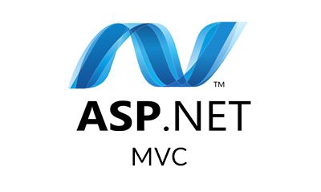

# Tech Events Manager

  
  
  

  
## Project Overview
Tech Events Manager is an ASP.NET MVC application which implements GoogleMaps API and Geocoding services as a tool for enabling users to locate tech meetup events in their local area. After entering a valid UK postcode, users can filter events according to proximity from their home address.

## GoogleMaps & Geocoding

